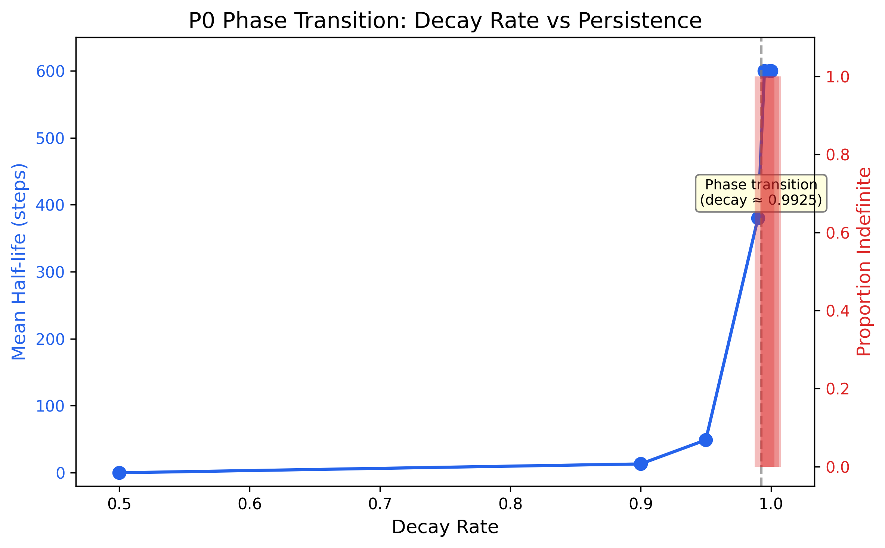
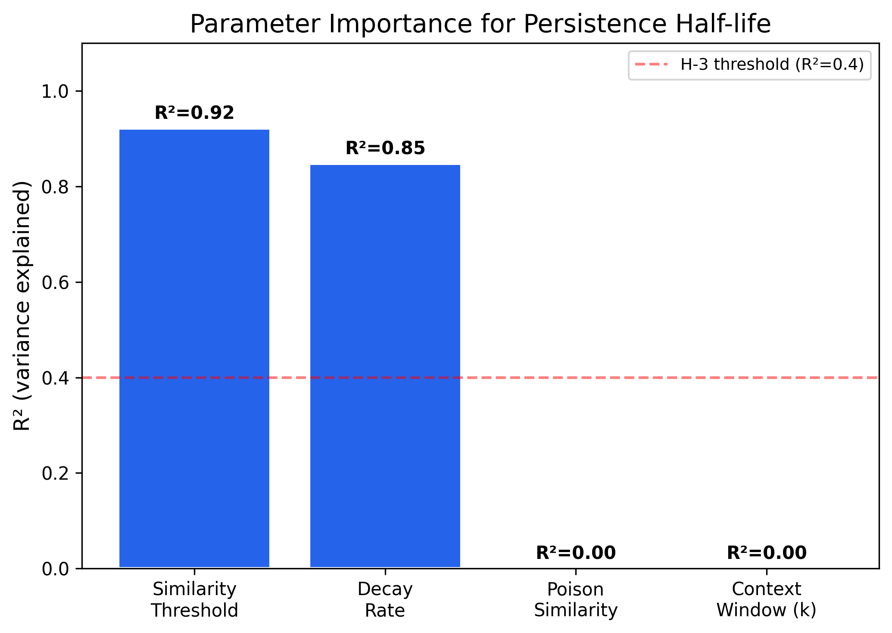
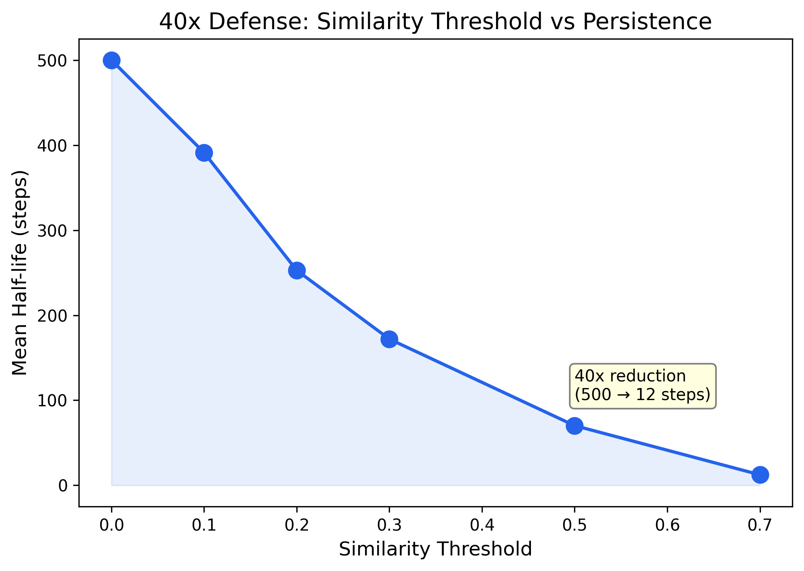

# LLM Memory Poisoning Detection: Persistence Bounds for Agent Memory Attacks

Formal characterization of when poisoned memories in LLM agents persist, decay, or amplify — as a computable function of memory architecture parameters. Provides a persistence number (P0) framework for detecting and predicting AI agent memory attack risk.

## Key Results

| Finding | Metric | Evidence |
|---------|--------|----------|
| Architecture determines persistence (>10x variation) | Half-life: 0 (recency) to indefinite (flat vector) | E1, 5 seeds |
| Similarity threshold is strongest predictor | R² = 0.92 (next: decay rate R² = 0.85) | E3, 4 parameter sweeps |
| Sharp phase transition at decay ≈ 0.9925 | Transition width: 0.005 decay-rate units | E2, 8 decay rates × 5 seeds |
| SIR epidemiological model fails for eviction-based architectures | Spearman rho = 0.304 (negative result) | E4, 6 configurations |

All results are from synthetic simulations (random embeddings, simulated architectures). Real-system validation is future work.

### Figures

| | |
|---|---|
|  |  |
| *Phase transition at decay_rate ≈ 0.9925* | *Similarity threshold explains 92% of persistence variance* |



*Increasing the similarity threshold from 0.0 to 0.7 reduces persistence half-life by 40x.*

## Quick Start

### Install

```bash
git clone https://github.com/rexcoleman/memory-poisoning-persistence.git
cd memory-poisoning-persistence
pip install -e ".[dev]"
```

### Run the Scorer

```python
from memory_poison_scorer import PersistenceScorer

scorer = PersistenceScorer()
result = scorer.assess({
    "architecture": "episodic",
    "decay_rate": 0.995,
    "similarity_threshold": 0.0,
    "memory_size": 1000,
    "retrieval_k": 5,
})

print(f"Risk: {result.risk_level}")           # CRITICAL
print(f"P0: {result.p0:.1f}")                 # 50.0
print(f"Half-life: {result.predicted_halflife}")  # None (indefinite)
```

### Reproduce All Experiments

```bash
bash reproduce.sh
```

This runs tests (52 passing), then all 6 experiments (E0-E5), and verifies output files. Expected runtime: ~1 minute on commodity hardware.

## Methodology

Full methodology in [EXPERIMENTAL_DESIGN.md](EXPERIMENTAL_DESIGN.md). All results in [FINDINGS.md](FINDINGS.md).

### Memory Architectures Tested

1. **Flat vector store** — cosine similarity retrieval, no decay
2. **Episodic memory** — cosine retrieval + exponential temporal decay
3. **Multi-layer memory** — working + episodic + semantic with consolidation
4. **Recency-weighted memory** — FIFO buffer, most recent first

### Experiments

| Experiment | Tests | Hypothesis |
|---|---|---|
| E0: Sanity | Positive/negative/dose-response controls | — |
| E1: Architecture comparison | 4 architectures × 5 seeds | H-1: >10x variation (SUPPORTED) |
| E2: P0 threshold | 8 decay rates × 5 seeds | H-2: Phase transition (SUPPORTED) |
| E3: Parameter importance | 4 parameter sweeps × 5 seeds | H-3: Threshold dominates (SUPPORTED) |
| E4: Cross-domain transfer | 6 configs, SIR model comparison | H-4: SIR predicts rank (REFUTED) |
| E5: Consolidation | Episodic vs multi-layer × 5 seeds | H-5: Amplification (INCONCLUSIVE) |

### The P0 Framework

We define the **persistence number** P₀, analogous to R₀ in epidemiology:

```
P₀ = retrieval_probability / effective_decay_rate
```

- P₀ > 1: poisoned memories persist indefinitely
- P₀ < 1: poisoned memories decay with finite half-life
- Sharp transition at P₀ ≈ 1

## Project Structure

```
memory-poisoning-persistence/
├── src/                          # Experiment code
│   ├── memory_architectures.py   # 4 architecture implementations
│   ├── poisoning.py              # Attack injection + measurement
│   ├── persistence_model.py      # P0 formal model
│   └── experiments.py            # E0-E5 experiment runner
├── memory_poison_scorer/         # Pip-installable artifact
│   └── scorer.py                 # PersistenceScorer API
├── tests/                        # 52 tests
├── outputs/experiments/          # All experiment results (JSON)
├── figures/                      # Publication-quality figures (300 DPI)
├── blog/draft.md                 # Blog post (1,443 words)
├── EXPERIMENTAL_DESIGN.md        # Pre-registered design (575 lines)
├── HYPOTHESIS_REGISTRY.md        # 5 hypotheses, all resolved
├── FINDINGS.md                   # Full findings (345 lines)
├── DECISION_LOG.md               # Design decisions + quality loop
├── CITATION.cff                  # Citation metadata
├── reproduce.sh                  # Full reproduction script
└── governance.yaml               # govML configuration
```

## Related Work

- [controllability-bound](https://github.com/rexcoleman/controllability-bound) — Defense difficulty decomposition into controllability and observability
- [agent-semantic-resistance](https://github.com/rexcoleman/agent-semantic-resistance) — Semantic privilege escalation in LLM agents
- [multi-agent-security](https://github.com/rexcoleman/multi-agent-security) — Cascade attacks in multi-agent systems
- Blog post: [Model Fingerprinting](https://rexcoleman.dev/posts/model-fingerprinting/)

## Limitations

- All experiments use synthetic simulations, not real LLM agents
- Parameter sweep ceiling effects at default decay rate (0.995) obscure secondary parameter importance
- The P0 model does not apply to eviction-based architectures (recency/FIFO)
- Consolidation amplification hypothesis remains untested in the discriminating regime
- Real-system validation against Mem0 or similar architectures is future work

## Requirements

- Python >= 3.10
- numpy >= 1.24
- scipy >= 1.10
- matplotlib >= 3.7

## Citation

```bibtex
@software{coleman2026memorypoisoning,
  title = {Memory Poisoning Persistence Bounds},
  author = {Coleman, Rex},
  year = {2026},
  url = {https://github.com/rexcoleman/memory-poisoning-persistence},
  license = {MIT}
}
```

## License

MIT
